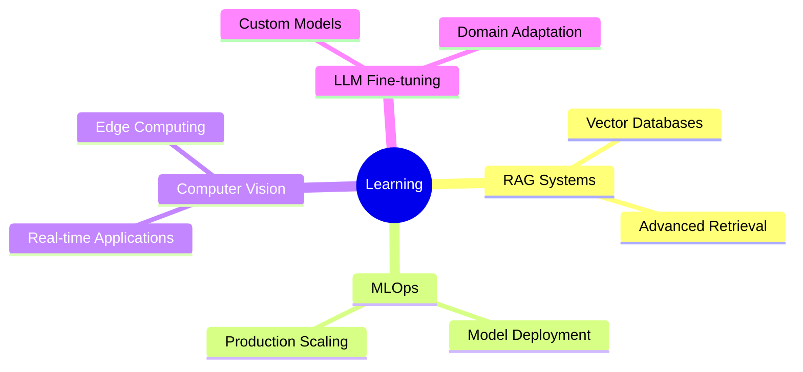

# <div align="center">🚀 **DEEP KHIMANI** 🚀</div>

<div align="center">
  
```ascii
╔══════════════════════════════════════════════════════════════════════════════╗
║                    🤖 DATA SCIENTIST & ML ENGINEER 🤖                       ║
║                          Building Intelligence, One Model at a Time          ║
╚══════════════════════════════════════════════════════════════════════════════╝
```

</div>

<div align="center">
  
[](https://git.io/typing-svg)

</div>

---

## 🌟 **ABOUT THE ARCHITECT**


```python
class DeepKhimani:
    def __init__(self):
        self.role = "Data Scientist & ML Engineer"
        self.location = "India 🇮🇳"
        self.passion = ["Machine Learning", "AI Innovation", "Problem Solving"]
        self.current_focus = "RAG Systems & Computer Vision"
        self.mission = "Turning Complex Data into Simple Insights"
    
    def get_expertise(self):
        return {
            "domains": ["ML", "NLP", "Computer Vision", "Data Analytics"],
            "mindset": "Always learning, always building",
            "goal": "Making AI accessible to everyone"
        }
```

<br clear="right"/>

---

## ⚡ **TECH ARSENAL**

<div align="center">

### 🔥 **CORE LANGUAGES**


### 🧠 **AI & MACHINE LEARNING**


### 🚀 **FRAMEWORKS & DEPLOYMENT**


</div>

---

## 🎯 **PROJECT SHOWCASE** 

<div align="center">

```
🌟 Each project is a journey from problem to solution 🌟
```

</div>

### 🏛️ **[MASTANI.AI - RAG-POWERED HISTORICAL INTELLIGENCE ENGINE](https://github.com/deep-khimani/Mastani.ai-A-RAG-Powered-System-for-Historical-Inquiry)**

<details>
<summary><b>🔍 Click to Explore the Innovation</b></summary>

```yaml
🎯 Mission: Making Pune's History Accessible Through AI
🧠 Intelligence: RAG + Google Generative AI + LangChain
💡 Innovation: Real-time historical information retrieval from PDF archives
🏆 Impact: Preserving and sharing cultural heritage digitally
⚡ Novelty: First-of-its-kind localized historical AI assistant for Pune
```

**🛠️ Tech Arsenal:** `Python` `LangChain` `Google Generative AI` `RAG` `NLP`

</details>

---

### 🔬 **[DATALENS - INTELLIGENT EDA AUTOMATION PLATFORM](https://github.com/deep-khimani/DataLens-Automated-EDA-with-Streamlit)**

<details>
<summary><b>🔍 Click to Explore the Innovation</b></summary>

```yaml
🎯 Mission: Democratizing Data Analysis for Everyone
⚡ Speed: Instant insights from raw CSV files with zero configuration
📊 Visualization: Auto-generated interactive charts and statistical summaries
🚀 Accessibility: Zero-code data exploration platform for non-technical users
⚡ Novelty: Fully automated EDA pipeline that adapts to any dataset structure
```

**🛠️ Tech Arsenal:** `Python` `Streamlit` `Pandas` `Plotly` `Data Visualization`

</details>

---

### 🎯 **[OMNIVISION - REAL-TIME HUMAN INTELLIGENCE SYSTEM](https://github.com/deep-khimani/Real-Time-Human-Detection-Pose-Estimation-with-Entry-Exit-Counting)**

<details>
<summary><b>🔍 Click to Explore the Innovation</b></summary>

```yaml
🎯 Mission: Advanced Computer Vision for Human Analytics
🎥 Real-time: Live detection and tracking with sub-second response
📊 Analytics: Smart entry/exit counting with behavioral pattern analysis
⚡ Performance: Lightweight architecture optimized for edge deployment
⚡ Novelty: Multi-person pose estimation with activity classification in real-time
```

**🛠️ Tech Arsenal:** `Python` `OpenCV` `MediaPipe` `Computer Vision` `Real-time Processing`

</details>

---

### 🚀 **[DELIVERYAI - PREDICTIVE LOGISTICS OPTIMIZATION ENGINE](https://github.com/deep-khimani/Food-Delivery-ETA-Prediction-Analysis-Visualization-and-Modeling)**

<details>
<summary><b>🔍 Click to Explore the Innovation</b></summary>

```yaml
🎯 Mission: Revolutionizing Delivery Operations with Predictive ML
📊 Analysis: Advanced feature engineering with geospatial and temporal data
🔮 Prediction: Ensemble ML models with dynamic accuracy optimization
💼 Business Impact: Cost reduction through intelligent delivery routing
⚡ Novelty: Multi-factor ETA prediction considering traffic, weather, and demand patterns
```

**🛠️ Tech Arsenal:** `Python` `Machine Learning` `Data Analytics` `Predictive Modeling`

</details>

---

### 🛡️ **[TRUTHGUARD - REAL-TIME MISINFORMATION DETECTION ENGINE](https://github.com/deep-khimani/Real-Time-Fake-News-Detection-with-NLP-and-Ensemble-ML)**

<details>
<summary><b>🔍 Click to Explore the Innovation</b></summary>

```yaml
🎯 Mission: Fighting Misinformation with Advanced AI Technology
🧠 Intelligence: Multi-layer NLP with ensemble ML classification
⚡ Speed: Real-time news article verification with confidence scoring
🎯 Accuracy: Deep linguistic pattern analysis and contextual understanding
⚡ Novelty: Hybrid ensemble approach combining multiple ML algorithms for maximum accuracy
```

**🛠️ Tech Arsenal:** `Python` `NLP` `Ensemble Methods` `Text Classification`

</details>

---

### 🎭 **[EMOTIONSENSE - ADVANCED VOCAL EMOTION INTELLIGENCE](https://github.com/deep-khimani/Comparative-Analysis-of-ML-Algorithms-for-Speech-Emotion-Recognition-Using-MFCC-Features)**

<details>
<summary><b>🔍 Click to Explore the Innovation</b></summary>

```yaml
🎯 Mission: Decoding Human Emotions Through Advanced Audio Analysis
🔊 Audio Analysis: Sophisticated MFCC feature extraction with signal processing
🤖 ML Comparison: Comprehensive benchmarking across multiple algorithms
📊 Research: Scientific approach to emotion recognition optimization
⚡ Novelty: Comparative ML study revealing optimal algorithms for emotion detection
```

**🛠️ Tech Arsenal:** `Python` `Audio Processing` `MFCC` `Machine Learning` `Classification`

</details>

---

## 🎓 **CONTINUOUS LEARNING JOURNEY**

<div align="center">



</div>

---

## 🤝 **LET'S BUILD SOMETHING AMAZING TOGETHER!**

<div align="center">

```
🌟 Always ready to collaborate on groundbreaking projects! 🌟
```

### 🔥 **COLLABORATION ZONES**
```yaml
🤖 Machine Learning & AI Applications
📊 Data Science & Analytics  
👁️ Computer Vision Projects
💬 NLP & Conversational AI
```

<br>

**💭 Have an idea? Let's turn it into reality!**

</div>

---

<div align="center">

```ascii
╔══════════════════════════════════════════════════════════════════════════════╗
║                                                                              ║
║           ⭐ "Turning Data into Insights, One Algorithm at a Time" ⭐        ║
║                                                                              ║
╚══════════════════════════════════════════════════════════════════════════════╝
```

</div>

<div align="center">

**Thanks for visiting my digital space! Let's connect and innovate together! 🚀**

</div>
