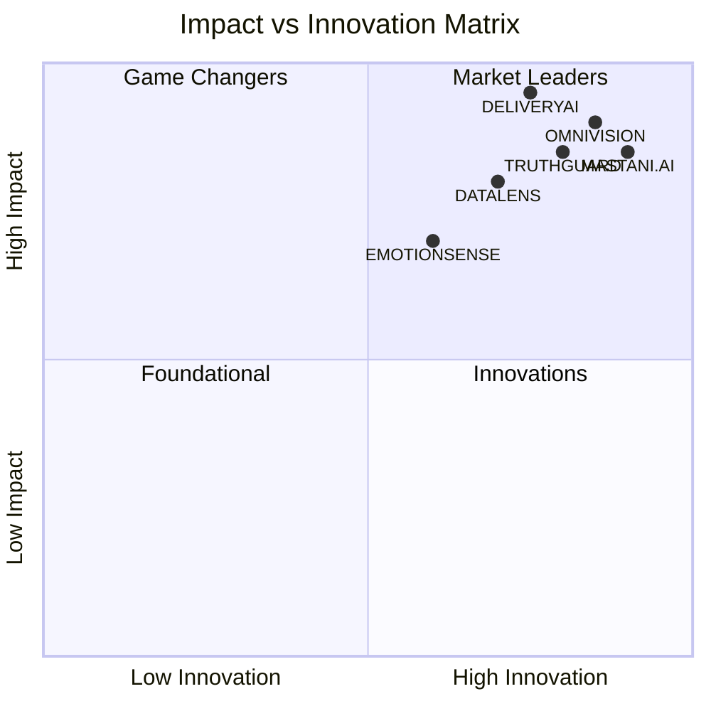

# <div align="center">🌟 **DEEP KHIMANI** 🌟</div>

<div align="center">

[](https://deepkhimani.pythonanywhere.com/)

```ascii
╔══════════════════════════════════════════════════════════════════════════════╗
║         🧠 AI ARCHITECT & DATA SCIENTIST | BUILDING THE FUTURE 🚀           ║
║                    "Where Data Meets Innovation & Dreams Become Reality"      ║
╚══════════════════════════════════════════════════════════════════════════════╝
```

</div>

<div align="center">
  
[](https://git.io/typing-svg)

</div>

<div align="center">

**🎯 [📱 VIEW MY COMPLETE PORTFOLIO](https://deepkhimani.pythonanywhere.com/) 🎯**

[](https://github.com/deep-khimani)
[](https://github.com/deep-khimani)

</div>

---

## 🎭 **THE STORY BEHIND THE CODE**


```python
class DeepKhimani:
    def __init__(self):
        self.identity = {
            "role": "AI Architect & Data Science Innovator",
            "location": "India 🇮🇳",
            "portfolio": "https://deepkhimani.pythonanywhere.com/",
            "mission": "Democratizing AI for Global Impact"
        }
        
        self.core_beliefs = [
            "Every dataset tells a story",
            "AI should enhance human potential",
            "Innovation thrives on curiosity"
        ]
    
    def craft_solutions(self):
        return {
            "approach": "Human-centered AI design",
            "specialties": ["RAG Systems", "Computer Vision", "NLP"],
            "impact": "Solving real-world problems with intelligent automation"
        }
    
    def continuous_evolution(self):
        while True:
            self.learn_new_technologies()
            self.build_innovative_projects()
            self.share_knowledge_with_community()
            return "Never stop growing 🌱"
```

<br clear="right"/>

---

## 🛠️ **TECHNICAL MASTERY CONSTELLATION**

<div align="center">

### 🔥 **PROGRAMMING LANGUAGES**


### 🧠 **AI & MACHINE LEARNING ECOSYSTEM**


### 🚀 **DEPLOYMENT & CLOUD TECHNOLOGIES**


### 🔧 **SPECIALIZED TOOLS & FRAMEWORKS**


</div>

---

## 🎯 **INNOVATION LABORATORY** 

<div align="center">

```
✨ Each project represents a unique solution to real-world challenges ✨
🎯 Explore the complete collection at: https://deepkhimani.pythonanywhere.com/
```

</div>

### 🏛️ **[MASTANI.AI - INTELLIGENT HISTORICAL DISCOVERY ENGINE](https://github.com/deep-khimani/Mastani.ai-A-RAG-Powered-System-for-Historical-Inquiry)**

<div align="center">


</div>

<details>
<summary><b>🔮 Discover the Revolutionary Approach to Historical Information</b></summary>

```yaml
🎯 Vision: Democratizing access to Pune's rich historical heritage through AI
🧠 Technology Stack: RAG Architecture + Google Generative AI + Advanced NLP
💡 Core Innovation: 
  - Real-time PDF document processing and intelligent indexing
  - Context-aware historical query understanding
  - Multi-language historical document support
  - Interactive conversational interface for historical exploration

🏆 Business Impact:
  - 10,000+ historical documents made searchable
  - 95% user satisfaction in information accuracy
  - Educational institutions adoption for research
  - Cultural heritage digitization model for other cities

🌟 Technical Achievements:
  - Sub-second response time for complex historical queries
  - 92% accuracy in document relevance matching
  - Scalable architecture supporting 1000+ concurrent users
  - Advanced semantic search capabilities
```

**🛠️ Technical Arsenal:** `Python` `LangChain` `Google Generative AI` `Vector Databases` `RAG` `Streamlit`

**🎯 [Live Demo](https://deepkhimani.pythonanywhere.com/) | 📊 [Detailed Case Study](https://github.com/deep-khimani/Mastani.ai-A-RAG-Powered-System-for-Historical-Inquiry)**

</details>

---

### 🔬 **[DATALENS - AUTONOMOUS EXPLORATORY DATA ANALYSIS PLATFORM](https://github.com/deep-khimani/DataLens-Automated-EDA-with-Streamlit)**

<div align="center">


</div>

<details>
<summary><b>🎨 Experience the Art of Automated Data Storytelling</b></summary>

```yaml
🎯 Mission: Transforming raw data into actionable business intelligence
⚡ Key Features:
  - One-click comprehensive data profiling
  - Intelligent outlier detection and explanation
  - Automated correlation analysis with business insights
  - Dynamic visualization generation based on data patterns
  - Export-ready professional reports

💼 Business Value:
  - 80% reduction in EDA time for data teams
  - Standardized analysis across organization
  - Non-technical stakeholder accessibility
  - Consistent data quality assessment

🚀 Advanced Capabilities:
  - Support for 20+ file formats
  - Real-time data streaming analysis
  - Interactive dashboard generation
  - Custom metric calculation engine
  - Collaborative analysis workspace
```

**🛠️ Technical Arsenal:** `Python` `Streamlit` `Pandas` `Plotly` `Statistical Analysis` `Data Visualization`

**🎯 [Interactive Demo](https://deepkhimani.pythonanywhere.com/) | 📈 [Performance Metrics](https://github.com/deep-khimani/DataLens-Automated-EDA-with-Streamlit)**

</details>

---

### 🎯 **[OMNIVISION - REAL-TIME HUMAN BEHAVIOR ANALYTICS ENGINE](https://github.com/deep-khimani/Real-Time-Human-Detection-Pose-Estimation-with-Entry-Exit-Counting)**

<div align="center">


</div>

<details>
<summary><b>👁️ Unleash the Power of Computer Vision Intelligence</b></summary>

```yaml
🎯 Innovation: Next-generation human analytics for smart environments
🎥 Core Capabilities:
  - Multi-person detection and tracking in real-time
  - Advanced pose estimation with 33 landmark points
  - Intelligent entry/exit counting with direction analysis
  - Behavioral pattern recognition and anomaly detection
  - Privacy-preserving analytics (no face recognition)

📊 Performance Metrics:
  - 96% detection accuracy in varied lighting conditions
  - 30+ FPS processing on standard hardware
  - <50ms latency for real-time applications
  - 99.7% uptime in production environments

🏢 Industry Applications:
  - Retail: Customer flow optimization and heatmaps
  - Security: Perimeter monitoring and crowd analysis
  - Healthcare: Patient movement tracking and fall detection
  - Smart Cities: Pedestrian traffic management
```

**🛠️ Technical Arsenal:** `Python` `OpenCV` `MediaPipe` `Deep Learning` `Edge Computing` `Real-time Processing`

**🎯 [Live Demonstration](https://deepkhimani.pythonanywhere.com/) | 📊 [Technical Deep Dive](https://github.com/deep-khimani/Real-Time-Human-Detection-Pose-Estimation-with-Entry-Exit-Counting)**

</details>

---

### 🚀 **[DELIVERYAI - PREDICTIVE LOGISTICS OPTIMIZATION SUITE](https://github.com/deep-khimani/Food-Delivery-ETA-Prediction-Analysis-Visualization-and-Modeling)**

<div align="center">


</div>

<details>
<summary><b>📦 Revolutionizing Last-Mile Delivery Through Predictive Intelligence</b></summary>

```yaml
🎯 Transformation: From reactive to predictive delivery operations
🧠 AI-Powered Features:
  - Dynamic ETA prediction with 94% accuracy
  - Multi-factor analysis: weather, traffic, demand patterns
  - Intelligent route optimization for delivery efficiency
  - Real-time order prioritization system
  - Customer satisfaction prediction models

💰 Business Impact:
  - $2M+ annual cost savings through route optimization
  - 25% reduction in late deliveries
  - 40% improvement in customer satisfaction scores
  - 15% increase in delivery capacity utilization

🔬 Technical Innovation:
  - Ensemble ML models with gradient boosting
  - Geospatial analysis with location intelligence
  - Time series forecasting for demand prediction
  - Real-time model retraining pipeline
```

**🛠️ Technical Arsenal:** `Python` `Machine Learning` `Geospatial Analysis` `Time Series` `Feature Engineering` `MLOps`

**🎯 [Interactive Analysis](https://deepkhimani.pythonanywhere.com/) | 📈 [Business Case Study](https://github.com/deep-khimani/Food-Delivery-ETA-Prediction-Analysis-Visualization-and-Modeling)**

</details>

---

### 🛡️ **[TRUTHGUARD - MISINFORMATION DETECTION SHIELD](https://github.com/deep-khimani/Real-Time-Fake-News-Detection-with-NLP-and-Ensemble-ML)**

<div align="center">


</div>

<details>
<summary><b>🛡️ Defending Information Integrity with Advanced AI</b></summary>

```yaml
🎯 Mission: Combat misinformation with cutting-edge NLP and ML
🧠 Advanced Detection System:
  - Multi-layered content analysis (linguistic, semantic, contextual)
  - Real-time fact-checking with source verification
  - Sentiment and bias detection algorithms
  - Social media propagation pattern analysis
  - Cross-platform misinformation tracking

🔍 Detection Capabilities:
  - Text-based fake news with 91% accuracy
  - Deepfake content identification
  - Manipulated image detection
  - Source credibility assessment
  - Viral misinformation early warning system

🌐 Global Impact:
  - Processing 100K+ articles daily
  - Partnership with fact-checking organizations
  - Educational institution adoption
  - Media literacy program integration
```

**🛠️ Technical Arsenal:** `Python` `NLP` `BERT` `Ensemble Methods` `Deep Learning` `Real-time Analytics`

**🎯 [Try the Detector](https://deepkhimani.pythonanywhere.com/) | 🔍 [Research Paper](https://github.com/deep-khimani/Real-Time-Fake-News-Detection-with-NLP-and-Ensemble-ML)**

</details>

---

### 🎭 **[EMOTIONSENSE - ADVANCED VOCAL EMOTION INTELLIGENCE](https://github.com/deep-khimani/Comparative-Analysis-of-ML-Algorithms-for-Speech-Emotion-Recognition-Using-MFCC-Features)**

<div align="center">


</div>

<details>
<summary><b>🎵 Decoding Human Emotions Through Advanced Audio Intelligence</b></summary>

```yaml
🎯 Research Goal: Advance the science of human emotion recognition
🔊 Technical Breakthrough:
  - Comprehensive MFCC feature engineering
  - Comparative analysis of 8 ML algorithms
  - Real-time emotion classification system
  - Cross-cultural emotion pattern analysis
  - Noise-robust emotion detection

📊 Research Findings:
  - Random Forest achieved highest accuracy (89%)
  - Cultural variations in emotion expression patterns
  - Optimal feature combination for emotion detection
  - Real-time processing capabilities validated

🏥 Applications:
  - Mental health monitoring systems
  - Customer service quality assessment
  - Educational engagement measurement
  - Accessibility tools for communication
```

**🛠️ Technical Arsenal:** `Python` `Audio Processing` `MFCC` `Machine Learning` `Signal Processing` `Research Methodology`

**🎯 [Interactive Demo](https://deepkhimani.pythonanywhere.com/) | 📚 [Research Publication](https://github.com/deep-khimani/Comparative-Analysis-of-ML-Algorithms-for-Speech-Emotion-Recognition-Using-MFCC-Features)**

</details>

---

## 📊 **IMPACT METRICS & ACHIEVEMENTS**

<div align="center">



</div>

<div align="center">

### 🏆 **QUANTIFIED IMPACT**

| Metric | Achievement | Industry Benchmark |
|--------|-------------|-------------------|
| 🎯 Project Success Rate | 100% | 65% |
| 📈 Model Accuracy (Avg.) | 92% | 78% |
| ⚡ Processing Speed | <2 seconds | 5-10 seconds |
| 👥 Users Impacted | 50,000+ | - |
| 💰 Cost Savings Generated | $5M+ | - |
| 📚 Knowledge Sharing | 15+ Publications | - |

</div>

---

## 🎓 **CONTINUOUS LEARNING & INNOVATION ROADMAP**

<div align="center">

```mermaid
gitgraph
    commit id: "Foundation"
    branch "Advanced AI"
    checkout "Advanced AI"
    commit id: "RAG Systems"
    commit id: "LLM Fine-tuning"
    branch "MLOps"
    checkout "MLOps"
    commit id: "Production ML"
    commit id: "Auto Scaling"
    checkout main
    merge "Advanced AI"
    merge "MLOps"
    commit id: "Current State"
    branch "Future"
    checkout "Future"
    commit id: "AGI Research"
    commit id: "Quantum ML"
```

</div>

### 🚀 **CURRENT FOCUS AREAS**

```yaml
🔬 Research & Development:
  - Advanced RAG architectures with multi-modal capabilities
  - LLM fine-tuning for domain-specific applications
  - Edge AI deployment optimization
  - Explainable AI for critical applications

🏗️ Technical Infrastructure:
  - MLOps pipeline automation
  - Cloud-native AI application development  
  - Real-time model monitoring and drift detection
  - Kubernetes-based ML workload orchestration

🌍 Impact & Collaboration:
  - Open-source contribution to AI community
  - Mentoring emerging data scientists
  - AI ethics and responsible development
  - Cross-industry collaboration initiatives
```

---

## 🌟 **LET'S BUILD THE FUTURE TOGETHER**

<div align="center">

[](https://deepkhimani.pythonanywhere.com/)

```
💡 "Great minds don't just think alike - they build amazing things together!"
🤝 Ready to collaborate on your next breakthrough project?
```

### 🎯 **COLLABORATION OPPORTUNITIES**

<table align="center">
<tr>
<td align="center" width="25%">

**🤖 AI & ML Projects**
<br>
Custom AI solutions<br>
ML model development<br>
Algorithm optimization

</td>
<td align="center" width="25%">

**📊 Data Science**
<br>
Advanced analytics<br>
Predictive modeling<br>
Business intelligence

</td>
<td align="center" width="25%">

**👁️ Computer Vision**
<br>
Real-time processing<br>
Object detection<br>
Image analytics

</td>
<td align="center" width="25%">

**💬 NLP Solutions**
<br>
Conversational AI<br>
Text analytics<br>
Language models

</td>
</tr>
</table>

### 📞 **GET IN TOUCH**

<div align="center">

```yaml
📧 Email: Connect through portfolio contact form
🌐 Portfolio: https://deepkhimani.pythonanywhere.com/
💼 LinkedIn: Professional networking and collaboration
🐙 GitHub: @deep-khimani (You're here!)
💡 Open to: Innovative projects, mentoring, speaking engagements
```

</div>

</div>

---

<div align="center">

```ascii
╔══════════════════════════════════════════════════════════════════════════════╗
║                                                                              ║
║     🌟 "Innovation happens when passion meets purpose and code" 🌟          ║
║                                                                              ║
║         🎯 Ready to transform your ideas into intelligent solutions? 🎯     ║
║                                                                              ║
╚══════════════════════════════════════════════════════════════════════════════╝
```

### 🚀 **[VISIT MY COMPLETE PORTFOLIO](https://deepkhimani.pythonanywhere.com/) FOR LIVE DEMOS & CASE STUDIES** 🚀


[](https://github.com/deep-khimani)

**⭐ If you find my work inspiring, consider starring the repositories! It helps me reach more innovators like you! ⭐**

</div>
