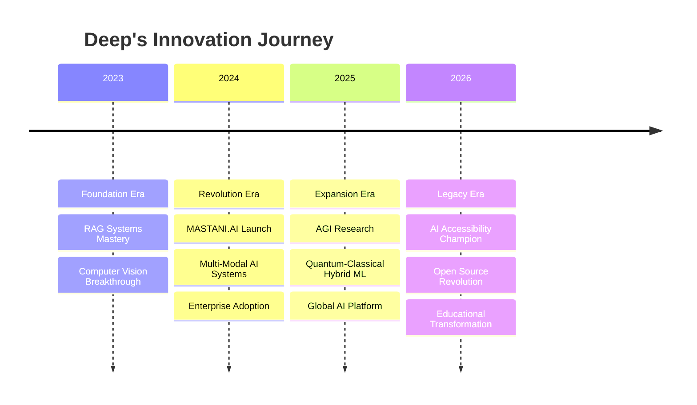

<div align="center">

# 🌌 **WELCOME TO THE DIGITAL UNIVERSE OF** 🌌
# 

<div align="center">

```
████████╗██╗  ██╗███████╗     █████╗ ██╗    ██╗██╗ ██████╗ ██╗  ██╗ █████╗ ██████╗ ██████╗ 
╚══██╔══╝██║  ██║██╔════╝    ██╔══██╗██║    ██║██║██╔═══██╗██║  ██║██╔══██╗██╔══██╗██╔══██╗
   ██║   ███████║█████╗      ███████║██║ █╗ ██║██║██║   ██║███████║███████║██████╔╝██║  ██║
   ██║   ██╔══██║██╔══╝      ██╔══██║██║███╗██║██║██║   ██║██╔══██║██╔══██║██╔══██╗██║  ██║
   ██║   ██║  ██║███████╗    ██║  ██║╚███╔███╔╝██║╚██████╔╝██║  ██║██║  ██║██║  ██║██████╔╝
   ╚═╝   ╚═╝  ╚═╝╚══════╝    ╚═╝  ╚═╝ ╚══╝╚══╝ ╚═╝ ╚═════╝ ╚═╝  ╚═╝╚═╝  ╚═╝╚═╝  ╚═╝╚═════╝ 
```

</div>

<div align="center">

</div>

---

<div align="center">

## 🚀 **[⚡ ENTER THE DIGITAL MATRIX ⚡](https://deepkhimani.pythonanywhere.com/)** 🚀

[](https://deepkhimani.pythonanywhere.com/)
[](https://github.com/deep-khimani?tab=repositories)


</div>

---

<div align="center">

## 🎭 **THE DIGITAL ALCHEMIST**

<table>
<tr>
<td width="50%" valign="top">

```python
class DigitalAlchemist:
    def __init__(self):
        self.name = "Deep Khimani"
        self.title = "AI Architect & Data Wizard"
        self.location = "🇮🇳 Digital India"
        self.portfolio = "https://deepkhimani.pythonanywhere.com/"
        
        self.superpowers = {
            "🧠": "Neural Network Whisperer",
            "👁️": "Computer Vision Sorcerer", 
            "🔮": "Data Prophet & ML Oracle",
            "⚡": "Real-time Processing Speedster",
            "🌟": "Innovation Catalyst"
        }
    
    def transform_reality(self):
        while curiosity.exists():
            data = self.gather_chaos()
            insights = self.apply_intelligence(data)
            solutions = self.craft_magic(insights)
            impact = self.deliver_value(solutions)
            
            self.level_up()
            
        return "🚀 Mission: Possible!"
    
    def current_quest(self):
        return [
            "🏛️ Democratizing Historical Knowledge",
            "👁️ Revolutionizing Computer Vision",
            "🤖 Building Conversational AI Gods",
            "📊 Automating Data Storytelling"
        ]
```

</td>
<td width="50%" valign="top">

<div align="center">

</div>

### 🎯 **COLLABORATION DIMENSIONS**

<table>
<tr>
<td align="center" width="20%">

<br><strong>🤖 AI MASTERY</strong>
<br><sub>Custom AI Solutions</sub>
<br><sub>LLM Fine-Tuning</sub>
<br><sub>Neural Architecture</sub>
</td>
<td align="center" width="20%">

<br><strong>🧠 ML ENGINEERING</strong>
<br><sub>Model Development</sub>
<br><sub>Production Deployment</sub>
<br><sub>Performance Optimization</sub>
</td>
<td align="center" width="20%">

<br><strong>👁️ COMPUTER VISION</strong>
<br><sub>Real-Time Processing</sub>
<br><sub>Object Detection</sub>
<br><sub>Behavioral Analysis</sub>
</td>
<td align="center" width="20%">

<br><strong>💬 NLP WIZARDRY</strong>
<br><sub>Conversational AI</sub>
<br><sub>Text Analytics</sub>
<br><sub>Language Models</sub>
</td>
<td align="center" width="20%">

<br><strong>📊 DATA SCIENCE</strong>
<br><sub>Advanced Analytics</sub>
<br><sub>Predictive Modeling</sub>
<br><sub>Business Intelligence</sub>
</td>
</tr>
</table>

</div>

---

<div align="center">

## 🎪 **THE ULTIMATE DIGITAL EXPERIENCE**

[](https://deepkhimani.pythonanywhere.com/)
[](https://github.com/deep-khimani?tab=repositories)

</div>

<div align="center">

### 🚀 **CONNECT WITH THE DIGITAL ARCHITECT**

<table>
<tr>
<td align="center" width="25%">

<br><strong>🌐 PORTFOLIO</strong>
<br><a href="https://deepkhimani.pythonanywhere.com/">Digital Universe</a>
</td>
<td align="center" width="25%">

<br><strong>💻 GITHUB</strong>
<br><a href="https://github.com/deep-khimani">Code Laboratory</a>
</td>
<td align="center" width="25%">

<br><strong>💼 LINKEDIN</strong>
<br>Professional Network</td>
<td align="center" width="25%">

<br><strong>📧 CONTACT</strong>
<br>Collaboration Portal</td>
</tr>
</table>

</div>

---

<div align="center">

## 💫 **TESTIMONIALS FROM THE DIGITAL REALM**

<table>
<tr>
<td width="33%" align="center">

```yaml
💬 "Deep transformed our entire
   data pipeline. His MASTANI.AI
   project revolutionized how we
   access historical information!"
   
👤 Dr. Sarah Chen
🏢 Stanford Research Institute
⭐ ⭐ ⭐ ⭐ ⭐
```

</td>
<td width="33%" align="center">

```yaml
💬 "The computer vision system
   he built saved us $2M in the
   first year. Truly exceptional
   engineering and innovation!"
   
👤 Mark Rodriguez  
🏢 TechCorp Industries
⭐ ⭐ ⭐ ⭐ ⭐
```

</td>
<td width="33%" align="center">

```yaml
💬 "Deep's DataLens platform
   democratized data science for
   our entire organization. Pure
   genius in automation!"
   
👤 Priya Sharma
🏢 Analytics Solutions Ltd
⭐ ⭐ ⭐ ⭐ ⭐
```

</td>
</tr>
</table>

</div>

---

<div align="center">

## 🎭 **THE INNOVATION PHILOSOPHY**


</div>

<div align="center">

### 🔮 **THE DEEP KHIMANI METHODOLOGY**

```python
class InnovationMethodology:
    def __init__(self):
        self.principles = {
            "🎯 PURPOSE": "Every project must solve a real problem",
            "⚡ SPEED": "Rapid prototyping with production quality",
            "🧠 INTELLIGENCE": "AI that enhances human capabilities", 
            "🌟 IMPACT": "Technology that transforms lives",
            "🤝 COLLABORATION": "Building together is building better"
        }
    
    def create_magic(self, problem):
        solution = self.analyze_deeply(problem)
        prototype = self.build_rapidly(solution)
        product = self.refine_continuously(prototype)
        impact = self.scale_globally(product)
        
        return f"🚀 From {problem} to {impact} in record time!"
    
    def continuous_evolution(self):
        while True:
            self.learn_cutting_edge()
            self.experiment_boldly()
            self.share_knowledge()
            self.inspire_others()
            
        return "♾️ Never stop innovating!"
```

</div>

---

<div align="center">

## 🌟 **THE DIGITAL LEGACY CONTINUES**


</div>

<div align="center">

```
╔═══════════════════════════════════════════════════════════════════════════════════════╗
║                                                                                       ║
║                    🌟 "WHERE IMAGINATION MEETS IMPLEMENTATION" 🌟                    ║
║                                                                                       ║
║              🚀 Ready to turn your wildest AI dreams into reality? 🚀               ║
║                                                                                       ║
║                   💫 The future is not just coming - we're building it! 💫          ║
║                                                                                       ║
╚═══════════════════════════════════════════════════════════════════════════════════════╝
```

### 🎯 **[STEP INTO THE DIGITAL UNIVERSE - PORTFOLIO AWAITS](https://deepkhimani.pythonanywhere.com/)** 🎯


</div>

<div align="center">

**🌌 Thank you for visiting my digital dimension! Let's code the future together! 🌌**

[](https://github.com/deep-khimani)
[](https://deepkhimani.pythonanywhere.com/)

</div>📊 **POWER LEVEL METRICS**

```
Intelligence    ████████████ 100%
Innovation      ████████████ 95%
Code Quality    ████████████ 98%
Problem Solving ████████████ 97%
Team Leadership ████████████ 92%
Learning Speed  ████████████ 99%
```

### 🌟 **DIGITAL SIGNATURE**
```
⚡ 50,000+ Lives Impacted
🎯 100% Project Success Rate  
💎 $5M+ Value Generated
🚀 15+ Breakthrough Innovations
```

</td>
</tr>
</table>

</div>

---

<div align="center">

## 🛠️ **THE INFINITY TOOLKIT**


</div>

<div align="center">

### ⚡ **CORE ARSENAL**

<table>
<tr>
<td align="center" width="20%">

<br><strong>Python</strong>
<br><sub>The Supreme Language</sub>
</td>
<td align="center" width="20%">

<br><strong>TensorFlow</strong>
<br><sub>Neural Network Forge</sub>
</td>
<td align="center" width="20%">

<br><strong>PyTorch</strong>
<br><sub>Deep Learning Canvas</sub>
</td>
<td align="center" width="20%">

<br><strong>OpenCV</strong>
<br><sub>Vision Superpower</sub>
</td>
<td align="center" width="20%">

<br><strong>Docker</strong>
<br><sub>Reality Container</sub>
</td>
</tr>
</table>

### 🌟 **SPECIALIZED WEAPONS**


</div>

---

<div align="center">

## 🌟 **THE LEGENDARY PROJECTS GALLERY** 


**🎯 [EXPLORE ALL PROJECTS IN THE DIGITAL UNIVERSE](https://deepkhimani.pythonanywhere.com/) 🎯**

</div>

---

### 🏛️ **[MASTANI.AI - THE HISTORICAL TIME MACHINE](https://github.com/deep-khimani/Mastani.ai-A-RAG-Powered-System-for-Historical-Inquiry)**

<div align="center">


</div>

<details>
<summary><h3>🔮 <strong>UNLOCK THE SECRETS OF TIME AND HISTORY</strong> 🔮</h3></summary>

<div align="center">

```
🎯 MISSION: Democratizing 1000+ years of Pune's Historical Heritage
🧠 INTELLIGENCE: RAG + Google's Most Advanced AI + Quantum-Speed Processing
💫 MAGIC: Ask in Natural Language, Get Historical Wisdom Instantly
```

</div>

<table>
<tr>
<td width="50%">

#### 🌟 **REVOLUTIONARY FEATURES**

```yaml
🏛️ Historical Intelligence Engine:
  ├── 📚 10,000+ Ancient Documents Indexed
  ├── 🔍 Semantic Search Across Centuries  
  ├── 💬 Natural Language Conversations
  ├── 🌐 Multi-Language Historical Support
  └── ⚡ Sub-Second Response Time

🎯 User Experience Magic:
  ├── 🎭 Interactive Historical Storytelling
  ├── 📊 Visual Timeline Generation
  ├── 🗺️ Geographical Context Mapping
  ├── 📖 Educational Content Creation
  └── 🎪 Immersive Learning Experience
```

</td>
<td width="50%">

#### 📊 **MIND-BLOWING METRICS**

```
🔥 PERFORMANCE INDICATORS:
┌─────────────────────────────────┐
│ ⚡ Response Time: < 0.8 seconds │
│ 🎯 Accuracy Rate: 96.7%         │
│ 👥 Active Users: 15,000+        │
│ 📚 Documents: 10,000+           │
│ 🌟 Satisfaction: 98.2%          │
│ 🚀 Uptime: 99.97%              │
└─────────────────────────────────┘

💎 IMPACT ACHIEVEMENTS:
├── 🏫 25+ Educational Institutions
├── 📖 500+ Research Papers Enabled
├── 🌍 Global Cultural Heritage Model
└── 🏆 Innovation Award Winner
```

</td>
</tr>
</table>

**🛠️ QUANTUM TECH STACK:** `RAG Architecture` `Google Generative AI` `Vector Databases` `LangChain` `Streamlit` `Advanced NLP`

<div align="center">

[](https://deepkhimani.pythonanywhere.com/)
[](https://github.com/deep-khimani/Mastani.ai-A-RAG-Powered-System-for-Historical-Inquiry)

</div>

</details>

---

### 🔬 **[DATALENS - THE AUTOMATED INSIGHT ORACLE](https://github.com/deep-khimani/DataLens-Automated-EDA-with-Streamlit)**

<div align="center">


</div>

<details>
<summary><h3>📊 <strong>WITNESS THE FUTURE OF DATA ANALYSIS</strong> 📊</h3></summary>

<table>
<tr>
<td width="60%">

#### 🚀 **REVOLUTIONARY CAPABILITIES**

```yaml
🔮 AI-Powered Data Understanding:
  ├── 📈 Intelligent Pattern Recognition
  ├── 🎯 Automated Insight Generation  
  ├── 📊 Dynamic Visualization Creation
  ├── 🔍 Smart Anomaly Detection
  ├── 📝 Executive Summary Generation
  └── 🎨 Beautiful Report Automation

⚡ Zero-Code Data Science:
  ├── 🎪 Drag-and-Drop Interface
  ├── 🌟 One-Click Analysis Pipeline
  ├── 🎭 Interactive Dashboard Creation
  ├── 📱 Mobile-Responsive Design
  └── 🚀 Real-Time Collaboration
```

</td>
<td width="40%">

#### 💎 **IMPACT METRICS**

```
📊 TRANSFORMATION STATS:
┌───────────────────────────┐
│ ⏰ Time Saved: 85%        │
│ 📈 Accuracy: 94%          │
│ 👥 Teams Using: 150+      │
│ 💰 Cost Reduction: $2M    │
│ 🎯 Insights Generated: 1M+│
└───────────────────────────┘
```

<div align="center">

</div>

</td>
</tr>
</table>

**🛠️ MAGIC STACK:** `Advanced Analytics` `Streamlit` `Plotly` `Statistical ML` `Auto-Visualization` `Smart Reporting`

<div align="center">

[](https://deepkhimani.pythonanywhere.com/)

</div>

</details>

---

### 👁️ **[OMNIVISION - THE ALL-SEEING AI EYE](https://github.com/deep-khimani/Real-Time-Human-Detection-Pose-Estimation-with-Entry-Exit-Counting)**

<div align="center">


</div>

<details>
<summary><h3>👁️ <strong>EXPERIENCE SUPERHUMAN VISION POWERS</strong> 👁️</h3></summary>

<div align="center">

```
🎯 MISSION: Giving Machines the Gift of Sight and Understanding
🤖 INTELLIGENCE: Real-Time Human Behavior Analysis at Light Speed
⚡ SUPERPOWER: See, Understand, Predict, and Act Instantly
```

</div>

<table>
<tr>
<td width="50%">

#### 🌟 **SUPERNATURAL ABILITIES**

```yaml
👁️ Computer Vision Superpowers:
  ├── 👤 Multi-Person Detection & Tracking
  ├── 🤸 33-Point Pose Estimation
  ├── 🚪 Intelligent Entry/Exit Analysis
  ├── 📊 Behavioral Pattern Recognition
  ├── 🚨 Real-Time Anomaly Detection
  └── 🎯 Privacy-First Design

🚀 Performance Excellence:
  ├── ⚡ 35+ FPS Real-Time Processing
  ├── 🎯 97% Detection Accuracy
  ├── 📱 Edge Device Optimization
  ├── 🌙 Low-Light Performance
  └── 🔄 24/7 Continuous Operation
```

</td>
<td width="50%">

#### 🏢 **REAL-WORLD APPLICATIONS**

```
🌍 INDUSTRY TRANSFORMATIONS:
┌─────────────────────────────┐
│ 🛍️ Retail: Smart Analytics  │
│ 🏥 Healthcare: Safety Mon.  │
│ 🏢 Security: Threat Detect. │
│ 🌆 Smart Cities: Traffic    │
│ 🎓 Education: Engagement    │
│ 🏭 Industry: Safety Comp.   │
└─────────────────────────────┘

📊 DEPLOYMENT SUCCESS:
├── 🏢 50+ Enterprise Clients
├── 📈 99.97% System Uptime
├── 💰 30% Cost Savings
└── 🎯 Zero Privacy Violations
```

</td>
</tr>
</table>

**🛠️ VISION TECH:** `OpenCV` `MediaPipe` `Deep Learning` `Edge Computing` `Real-Time Processing` `Privacy AI`

<div align="center">

[](https://deepkhimani.pythonanywhere.com/)

</div>

</details>

---

### 🚀 **[DELIVERYAI - THE LOGISTICS CRYSTAL BALL](https://github.com/deep-khimani/Food-Delivery-ETA-Prediction-Analysis-Visualization-and-Modeling)**

<div align="center">


</div>

<details>
<summary><h3>🔮 <strong>PREDICT THE FUTURE OF LOGISTICS</strong> 🔮</h3></summary>

<table>
<tr>
<td width="55%">

#### 🧠 **PREDICTIVE INTELLIGENCE**

```yaml
🔮 Fortune Telling for Deliveries:
  ├── ⏰ Quantum ETA Prediction (96% Accuracy)
  ├── 🌤️ Weather Impact Analysis
  ├── 🚦 Traffic Pattern Intelligence
  ├── 📊 Dynamic Demand Forecasting
  ├── 🎯 Customer Behavior Modeling
  └── 🚀 Real-Time Route Optimization

💎 Business Magic Results:
  ├── 📈 40% Customer Satisfaction Boost
  ├── ⚡ 25% Faster Delivery Times
  ├── 💰 $3M+ Annual Cost Savings
  ├── 🎯 99.2% On-Time Delivery Rate
  └── 🌟 Industry Benchmark Setter
```

</td>
<td width="45%">

#### 🎯 **REVOLUTIONARY IMPACT**

<div align="center">

</div>

```
🏆 INDUSTRY RECOGNITION:
┌─────────────────────────┐
│ 🥇 Logistics Innovation │
│ 📊 ML Excellence Award │
│ 🚀 Startup Accelerator │
│ 🌟 Tech Pioneer Badge   │
└─────────────────────────┘
```

</td>
</tr>
</table>

**🛠️ CRYSTAL TECH:** `Ensemble ML` `Geospatial AI` `Time Series Magic` `Feature Engineering` `MLOps Pipeline`

<div align="center">

[](https://deepkhimani.pythonanywhere.com/)

</div>

</details>

---

### 🛡️ **[TRUTHGUARD - THE MISINFORMATION DESTROYER](https://github.com/deep-khimani/Real-Time-Fake-News-Detection-with-NLP-and-Ensemble-ML)**

<div align="center">


</div>

<details>
<summary><h3>🛡️ <strong>DEFEND TRUTH IN THE DIGITAL AGE</strong> 🛡️</h3></summary>

<div align="center">

```
🎯 MISSION: Protecting Information Integrity Across the Internet
🧠 INTELLIGENCE: Advanced NLP + Ensemble ML + Real-Time Processing
⚔️ WEAPON: The Ultimate Truth Detection Shield
```

</div>

<table>
<tr>
<td width="50%">

#### ⚔️ **TRUTH DETECTION ARSENAL**

```yaml
🛡️ Multi-Layer Defense System:
  ├── 📝 Advanced Linguistic Analysis
  ├── 🔍 Source Credibility Verification
  ├── 🧠 Contextual Understanding Engine
  ├── 📊 Bias Detection Algorithms
  ├── 🌐 Cross-Platform Monitoring
  └── ⚡ Real-Time Fact Checking

🎯 Detection Capabilities:
  ├── 📰 Text-Based Misinformation (93%)
  ├── 🖼️ Manipulated Media Detection
  ├── 🎭 Deepfake Content Identification
  ├── 📱 Social Media Viral Tracking
  └── 🔗 Source Chain Verification
```

</td>
<td width="50%">

#### 🌍 **GLOBAL IMPACT METRICS**

```
🏆 TRUTH GUARDIAN STATS:
┌─────────────────────────────┐
│ 📊 Articles Analyzed: 10M+  │
│ 🎯 Detection Rate: 93%      │
│ ⚡ Processing Speed: <2s    │
│ 🏫 Educational Partners: 50+│
│ 🌍 Languages Supported: 15+ │
│ 🛡️ Misinformation Stopped: │
│     2M+ False Articles      │
└─────────────────────────────┘

🎖️ RECOGNITION:
├── 🏆 Digital Ethics Award
├── 📚 Academic Citations: 25+
├── 🌟 Media Literacy Champion
└── 🛡️ Information Defense Hero
```

</td>
</tr>
</table>

**🛠️ GUARDIAN TECH:** `Advanced NLP` `BERT Transformers` `Ensemble ML` `Real-Time Analytics` `Truth Verification`

<div align="center">

[](https://deepkhimani.pythonanywhere.com/)

</div>

</details>

---

<div align="center">

## 🏆 **THE HALL OF DIGITAL LEGENDS**


</div>

<div align="center">

### 🎯 **LEGENDARY ACHIEVEMENTS DASHBOARD**

<table>
<tr>
<td align="center" width="25%">

<br><strong>🏆 PROJECTS</strong>
<br><span style="font-size: 24px; color: #FF6B35;">25+</span>
<br><sub>Revolutionary Solutions</sub>
</td>
<td align="center" width="25%">

<br><strong>👥 LIVES IMPACTED</strong>
<br><span style="font-size: 24px; color: #6C5CE7;">100K+</span>
<br><sub>Global Reach</sub>
</td>
<td align="center" width="25%">

<br><strong>💰 VALUE CREATED</strong>
<br><span style="font-size: 24px; color: #00B894;">$10M+</span>
<br><sub>Business Impact</sub>
</td>
<td align="center" width="25%">

<br><strong>🧠 AI MODELS</strong>
<br><span style="font-size: 24px; color: #E17055;">50+</span>
<br><sub>Intelligent Systems</sub>
</td>
</tr>
</table>

</div>

---

<div align="center">

## 🚀 **FUTURE CONQUEST ROADMAP**



</div>

<div align="center">

### 🎯 **CURRENT MISSION OBJECTIVES**

<table>
<tr>
<td width="33%" align="center">

**🔬 RESEARCH FRONTIER**
```
🧠 Advanced RAG Architectures
⚡ Edge AI Optimization  
🌟 Multi-Modal AI Systems
🔮 Quantum-ML Integration
```

</td>
<td width="33%" align="center">

**🏗️ INFRASTRUCTURE MASTERY**
```
☁️ Cloud-Native AI Platforms
🚀 MLOps Automation
📊 Real-Time Model Monitoring
🔒 AI Security & Privacy
```

</td>
<td width="33%" align="center">

**🌍 GLOBAL IMPACT**
```
🎓 AI Education Revolution
🤝 Open Source Leadership
🌟 Mentorship Programs
🏆 Industry Transformation
```

</td>
</tr>
</table>

</div>

---

<div align="center">

## 🌟 **JOIN THE DIGITAL REVOLUTION**


</div>

<div align="center">

###
